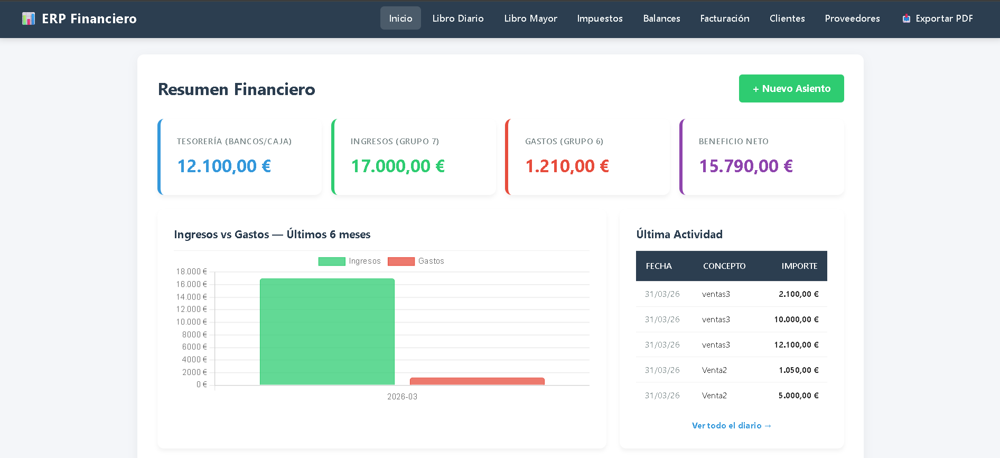
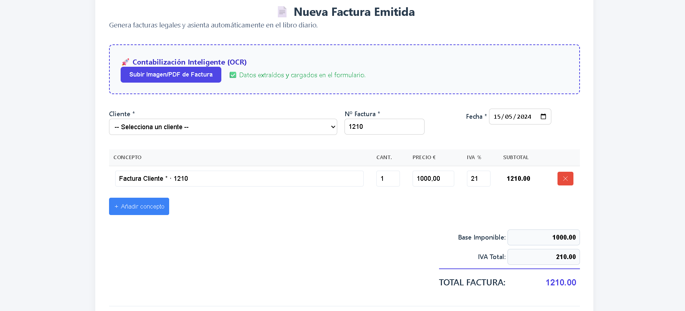
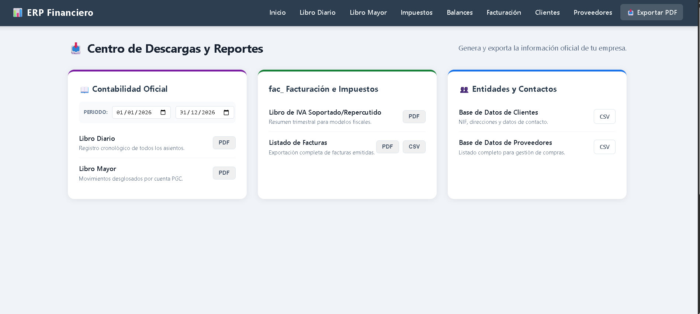

# 🏦 ERP Financiero — Gestión Contable & OCR

<p align="center">
  
  
  
  
</p>
<p align="center">
Desarrollado con ❤️ por <a href="https://www.google.com/search?q=https://github.com/ralmher95">ralmher95</a>
</p>

Este es un sistema integral de **gestión financiera** desarrollado en PHP. Su propósito es automatizar la contabilidad empresarial mediante la digitalización de documentos físicos con tecnología **OCR** y la generación de reportes profesionales en **PDF**.

> [!IMPORTANT]
> **Portfolio Showcase:** Este proyecto demuestra capacidades avanzadas en arquitectura de software (PSR-4), seguridad backend e integración de binarios del sistema en entornos web.

---

## 🎯 ¿Qué hace este proyecto?

El sistema cubre las necesidades críticas de un departamento financiero:

* **📈 Gestión Contable:** Control del Plan General Contable y registro de asientos.
* **👁️ Digitalización OCR:** Extracción de texto desde tickets/facturas con **Tesseract OCR**.
* **📄 Reportes Dinámicos:** Generación de balances y facturas mediante **Dompdf**.
* **📊 Dashboard Inteligente:** Visualización de métricas críticas en tiempo real.
* **🛡️ Seguridad Senior:** Protección de sesiones, sanitización de datos y gestión de secretos.
* **📂 Almacenamiento:** Gestión eficiente de archivos en el servidor (`storage/`).

---

## 🛠️ Tecnologías y Herramientas

### **Core Stack**
* **Backend:** PHP (Arquitectura MVC propia) & Python (Scripts de utilidad).
* **Database:** MySQL / MariaDB (Esquema relacional optimizado).
* **Frontend:** HTML5, CSS3 (Diseño responsivo) y JavaScript (ES6+).

### **Librerías Clave**
| Librería | Función |
| :--- | :--- |
| **Dompdf** | Renderizado de plantillas HTML a PDF profesional. |
| **Tesseract OCR** | Motor de reconocimiento óptico de caracteres. |
| **Chart.js** | Visualización de datos y analítica financiera. |
| **PHPMailer** | Sistema de notificaciones y envío de facturas. |

---

## 🧠 Conceptos Técnicos Aplicados

* **Autoloading PSR-4:** Estructura modular y profesional para una carga de clases eficiente.
* **Interoperabilidad de Sistemas:** Comunicación entre PHP y motores externos del SO.
* **Arquitectura Limpia:** Separación estricta entre lógica de negocio (`src/`) y punto de entrada público (`public/`).
* **Gestión de Buffers:** Optimización de memoria al renderizar documentos complejos.

---
## ⚙️ Instalación y Despliegue 
Sigue estos pasos para configurar el entorno local:

**1. Clonar y Dependencias**
Bash
git clone [https://github.com/ralmher95/erp-financiero.git](https://github.com/ralmher95/erp-financiero.git)
cd erp-financiero
composer install
**2. Configurar Base de Datos**
Crea el archivo config/db_connect.php basándote en la estructura de tu servidor local.

**3. Requisito de Sistema (OCR)**
Es indispensable tener instalado el motor Tesseract:

Ubuntu: sudo apt install tesseract-ocr

Windows: Instalar binario oficial y añadir la ruta al PATH.

## 🚀 Aprendizaje y Retos
El Reto OCR: Implementar la limpieza de imágenes y gestión de permisos en el servidor para maximizar la precisión de lectura.

Integridad SQL: Diseño de consultas complejas para garantizar balances contables exactos.

Escalabilidad: Uso de namespaces para mantener un código limpio y mantenible.

## 🔮 Mejoras Futuras
[ ] Auth: Implementar autenticación robusta mediante JWT.

[ ] AI: Integrar OpenCV para pre-procesamiento de imagen avanzado.

[ ] API: Crear una interfaz REST para conectividad móvil.

## 📸 Capturas del Proyecto

| **Dashboard Principal** | **Módulo de OCR** | **Reporte PDF** |
| :---: | :---: | :---: |
|  |  |  |

---
## 📝 Conclusión
Este ERP consolida conocimientos en arquitectura de software, seguridad y automatización. Representa un paso firme en mi evolución como desarrollador enfocado en soluciones eficientes, escalables y profesionales para el mundo real. Este proyecto esta diseñado con fines educativos.

Desarrollado con enfoque en la eficiencia y la arquitectura limpia por ralmher95.

## 📂 Estructura del Repositorio

```bash
erp-financiero/
├─ config/           # Configuración de base de datos (Protegido)
├─ docs/             # Recursos de documentación e imágenes
├─ public/           # Directorio raíz del servidor (Assets JS/CSS)
├─ src/              # Lógica de negocio (Namespaces App\...)
├─ storage/          # Almacén de archivos procesados y temporales
├─ .gitignore        # Exclusión de credenciales y dependencias
└─ README.md         # Manual del proyecto


---


